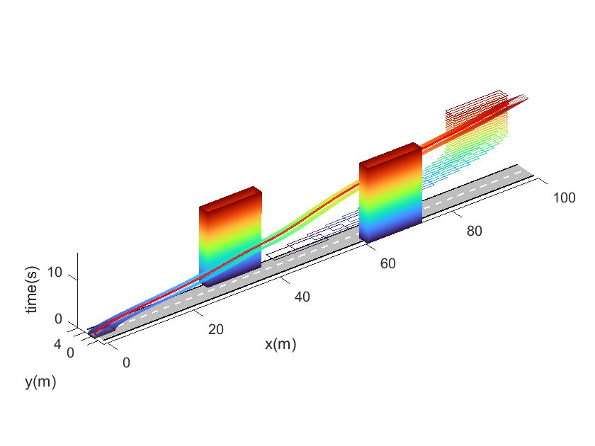
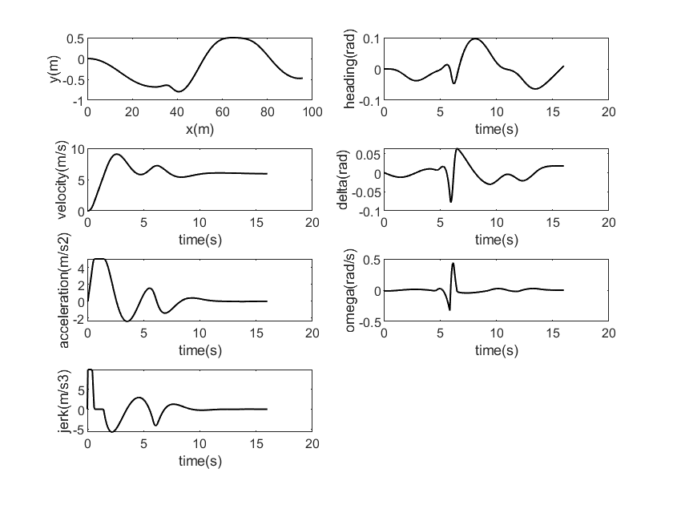

# Cartesian Planner

A matlab version of paper: Autonomous Driving on Curvy Roads without Reliance on Frenet Frame: A Cartesian-based Trajectory Planning Method, repo: [libai1943/CartesianPlanner: Source codes related to “Autonomous Driving on Curvy Roads without Reliance on Frenet Frame: A Cartesian-based Trajectory Planning Method” published in IEEE Trans. Intelligent Transportation Systems (github.com)](https://github.com/libai1943/CartesianPlanner)

## 1. Scenario

You can generate test case by coding `scenario/scenario.m`

## 2. Run program

Run `Main.m`.

## 3. View results

Figures of program is in `CartesianPlanner/figure`. For the demo, you can see:

